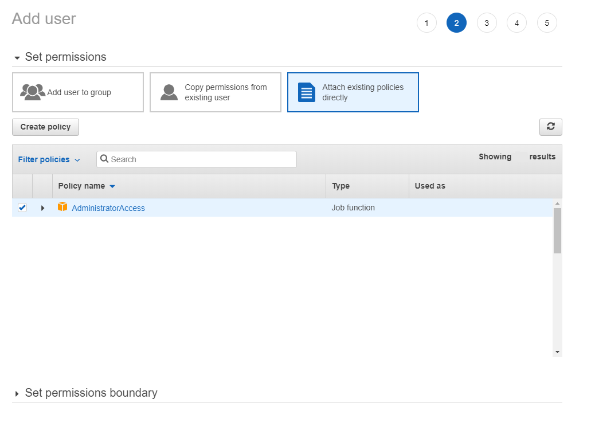

# Using AWS SSM in local setups

> https://docs.aws.amazon.com/sdk-for-java/v1/developer-guide/setup-credentials.html
> not just for java

## Create a KMS key and a parameter on AWS (follow awssmps/common guide)

## Create a new user for the application (on premise app) or one for your machine (for local development). You will run it locally, of course, but to set up policies, we need one.
## Enable programmatic access.

## Edit the policy settings for the role, by inline policies. See the awssmps/common guide in the other folder about the specifics for on premise applications.
## Alternatively add Administrator access, if You are setting up a local development environment - this is a lazy solution


## Next-next-finish the user creation.
## After the `Create user` button, a screen will come up with the access key. This is showing only now, and only now.

## Copy the values in the following format into a file:
### - `~/.aws/credentials` on Linux, macOS, or Unix
### - `C:\Users\USERNAME\.aws\credentials` on Windows
```
[default]
aws_access_key_id = your_access_key_id
aws_secret_access_key = your_secret_access_key
```

## Now your apps are ready for use locally!

